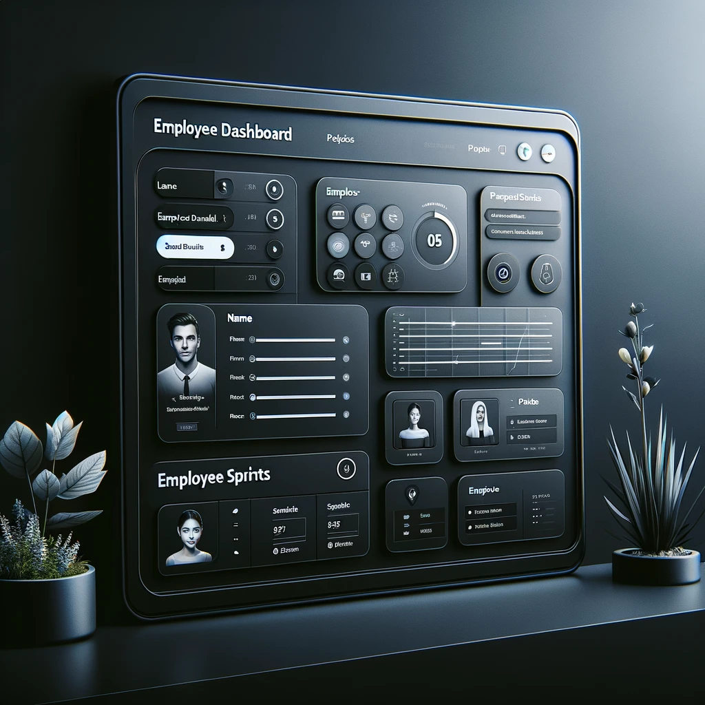

# Project Title: Employee Dashboard

A dynamic Employee Dashboard application designed to manage and display employee details, sprints, and photos using modern web technologies. This project demonstrates the use of JavaScript modules, the Fetch API, and modern CSS styling to create a professional-looking dashboard.

## Table of Contents

- [Project Title: Employee Dashboard](#project-title-employee-dashboard)
  - [Table of Contents](#table-of-contents)
  - [Features](#features)
  - [Technologies Used](#technologies-used)
  - [Setup and Installation](#setup-and-installation)
  - [Usage](#usage)
    - [Viewing Employee Details](#viewing-employee-details)
    - [Searching for Employees](#searching-for-employees)
  - [Contributing](#contributing)
  - [License](#license)

## Features

- **Dynamic Employee Information**: Automatically fetches and displays employee details from an external API.
- **Search Functionality**: Allows users to search for employees by name or email.
- **Modern, Responsive Design**: Utilizes a dark theme for a professional appearance and is responsive to various screen sizes.

## Technologies Used

- HTML5
- CSS3
- JavaScript (ES6)
- Fetch API

## Setup and Installation

1. Clone the repository:

   ```sh
   git clone https://yourrepositorylinkhere.com
   ```

2. Navigate to the project directory:
   ```sh
   cd employee-dashboard
   ```

## Usage

### Viewing Employee Details

- The dashboard automatically displays employee details fetched from the API upon loading.
- Employee information includes photos, names, emails, and phone numbers.

### Searching for Employees

- Use the search box at the top of the dashboard to filter employees by name or email.

## Contributing

Contributions are what make the open-source community such an amazing place to learn, inspire, and create. Any contributions you make are greatly appreciated.

To contribute:

1. Fork the Project
2. Create your Feature Branch (git checkout -b feature/AmazingFeature)
3. Commit your Changes (git commit -m 'Add some AmazingFeature')
4. Push to the Branch (git push origin feature/AmazingFeature)
5. Open a Pull Request

## License

Distributed under the MIT License.
